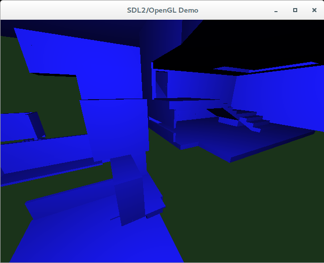

MessyBsp
========

Q3 BSP file loading, collision detection and rendering experimentation.  
It's called MessyBsp because the code is hardly clean looking, and the rendering isn't that fancy.



Features
--------
 * Only draws the brushes of a bsp! That's the stuff you collide with!
 * Low-fi lighting model
 * xbox360 controller support
 * silent!
 * Dull greens, shiney blues
 * Doesn't seem to draw all the brushes! Buggy!
 * Builds and runs on Linux and Windows7


Usage
-----

```
MessyBsp - By Richard Maxwell

  Renders or does a collsion detection benchmark on a quake3 bsp.

  MessyBsp [-b] [-h] [-f <path to quake3 bsp>]

  -b:  Benchmark 100,000 random collision tests
       Prints the cost in Microseconds. Otherwise
       Renders all the solid brushes using opengl.

  -f:  Quake3 bsp file to use. Defaults to 'final.bsp'.

  -h:  This help text. 

```

Building
--------
### Requirements:

 * C++14 compiler (latest GCC, clang, MSVC2015)
 * CMake 3.1 (3.2 for windows builds)^([1])
 * SDL2^([2])
 * glew^([3])

### Preparation
On linux:

```bash
git clone https://github.com/JodiTheTigger/MessyBsp.git
mkdir MessyBsp-build
cd MessyBsp-build
cmake ../MessyBsp # -G Ninja # if you use ninja for building.
```

You then need to update the cache variables to point to sdl2, and glew if they are not found automatically.

### Building

Assuming you just ran cmake:  
```bash
make # or Ninja # if you used the Ninja generator
```


[1]: http://www.cmake.org/
[2]: https://www.libsdl.org/
[3]: http://glew.sourceforge.net/

What I learned
--------------
 * How to parse Quake3 bsp files
 * How to do ray, sphere and capsule collision tests using a BSP tree
 * Convex hull generation
 * Finding single point three plane intersections (if they exist).
 * Generic lambdas in C++14
 * Alignas and struct packing
 * Matrix maths, identities and shortcuts
 * Model, View, and Projection matrcies
 * Basic bring up and tear down of OpenGL state for a vertex and fragment shader pipeline
 * What happens when your z buffer resultion is too low
 * Sdl2 
 * Glew
 * GL_KHR_debug
 * Xbox360 controller support 
 * Custom controller support when your xbox360 controller isn't recognised by sdl
 * To be at peace with compiler warnings generated by 3rd party code.
 * MSVC2015 preview doesn't support constexpr constructor initlisers yet
 * My code is crap (but that axiom is true for anyones code)